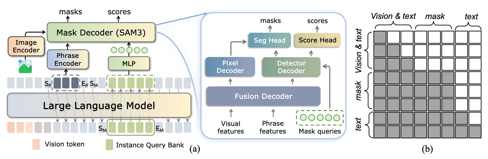

# InstructSAM

Natural-language image segmentation in native C++/ggml. Feed an image + a
text prompt like `"Please segment 'box', 'person', 'forklift' in this image."`
and get per-object mask PNGs plus a side-by-side overlay panel. CPU-only,
end-to-end in ~1.7 min for a 640×426 input on a 12-core laptop.

## Quick start (Docker)

```bash
docker run --rm \
  -v $PWD/images:/in \
  -v $PWD/out:/out \
  ghcr.io/smellslikeml/instructsam:latest \
    --image /in/warehouse.jpg \
    --query ""Please list the main objects in this scene."" \
    --out-dir /out --run-vision
```


Weights are converted from `CircleRadon/InstructSAM-2B` at Docker build
time — no republishing. See `docker/Dockerfile` for the recipe.

## Build from source

Requires a built llama.cpp checkout adjacent to this repo (`../llama.cpp/build/`
must contain `libmtmd.a`, `libllama.a`, `libggml*.a`). See `docker/Dockerfile`
for the exact llama.cpp commit and build flags we pin.

```bash
cmake -S . -B build -DCMAKE_BUILD_TYPE=Release
cmake --build build --target instructsam -j
```

## What it does



- Vision encoder + FPN neck extract dense multi-scale features from the input image
- Qwen3-VL LM (via libmtmd) prefills the vision embeddings + user prompt with correct M-RoPE positions, then AR-decodes to emit `<|object_ref_start|>PHRASE<|object_ref_end|>` markers per requested object
- Per-phrase mask-query injection at each `<|object_ref_end|>` boundary: 10 candidate mask hypotheses per phrase, extracted as hidden states from the LM
- Detector decoder consumes those hypotheses as queries and produces refined per-slot mask logits
- Score head selects the best slot per phrase; pixel decoder produces dense pixel masks that get upsampled to input resolution
- CLI (`instructsam`) writes `pred_masks.f32`, per-object PNGs, and an overlay panel

See `docs/instructsam/` for the design notes and integration plan.

## Weights + sidecars

Four artifacts, all converted at Docker build time (or via
`tools/pathb_convert_lm_mmproj.sh` + `tools/convert_instructsam_to_gguf.py`
+ `tools/extract_mask_queries.py` if building locally):

- `instructsam-lm-Q4_K_M.gguf` — quantized LM (~1.5 GB, default runtime)
- `instructsam-lm-f16.gguf` — full-precision LM (~3.3 GB)
- `instructsam-mmproj-f16.gguf` — vision projector (~780 MB)
- `instructsam-grounding-f16.gguf` — DETR + FPN + mask decoder + scoring head (~1 GB)
- `instructsam_mask_queries.f32` — learned mask-query template embeddings (~80 KB)


## License

Apache-2.0. Weights derive from `CircleRadon/InstructSAM-2B` (upstream declares
no explicit license); at-build-time conversion sidesteps redistribution.

## Upstream + acknowledgements

- **Depends on [llama.cpp](https://github.com/ggml-org/llama.cpp)** for the LM
  half — specifically `libmtmd` for multimodal prefill (M-RoPE handling of image
  tokens) and `libllama` for the KV cache + decode loop. The LM stage delegates
  end-to-end to `mtmd_helper_eval_chunks` + `llama_decode`; native ggml is used
  only for the vision path and the DETR mask chain.
- **Forked from [ropoctl/sam3cpp](https://github.com/ropoctl/sam3cpp)** by
  Robert Ó Callaghan — the vision encoder, FPN neck, and DETR structural code
  originate there.
- **InstructSAM paper + checkpoint**:
  [CircleRadon/InstructSAM-2B](https://huggingface.co/CircleRadon/InstructSAM-2B).
  Architecture figure above is reproduced from the InstructSAM paper.
